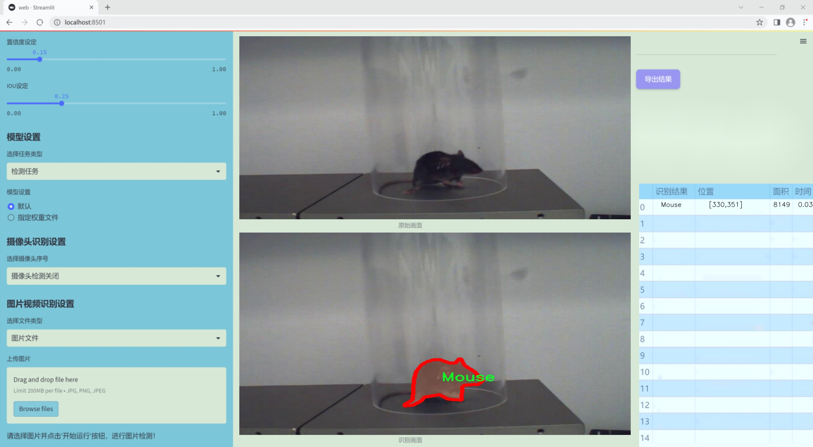
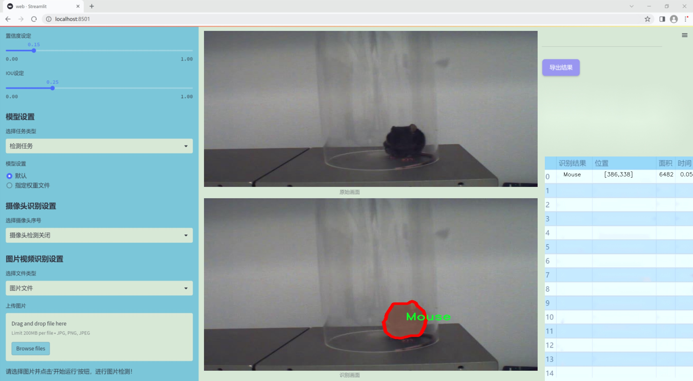
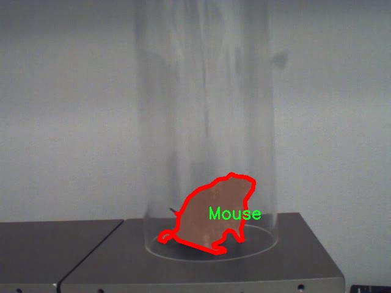
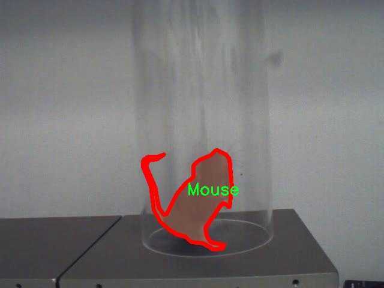
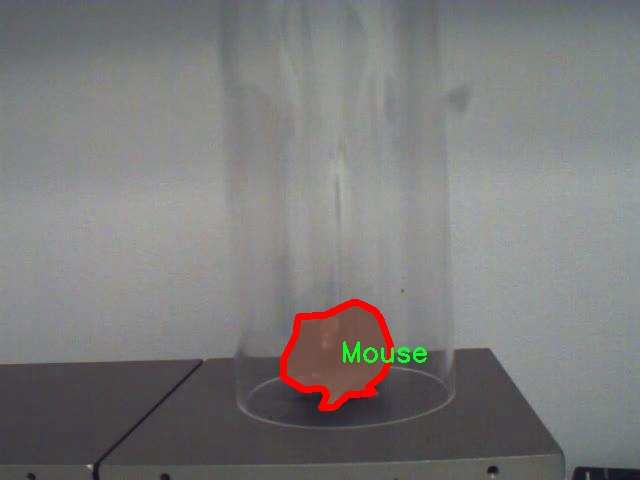
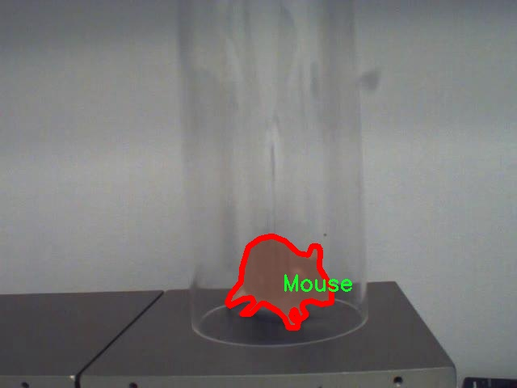
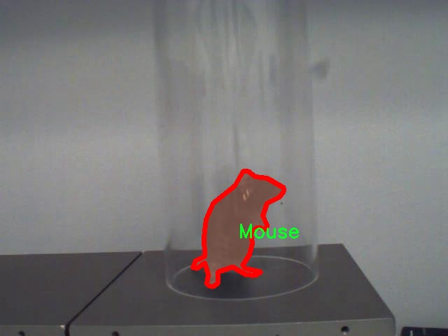

### 1.背景意义

研究背景与意义

在生物医学研究中，小鼠作为一种重要的实验动物，广泛应用于药物开发、疾病模型研究及行为学实验等领域。随着科学技术的进步，传统的观察和记录小鼠行为的方法逐渐显露出其局限性，尤其是在数据收集的效率和准确性方面。因此，开发一种高效、准确的小鼠实例分割系统显得尤为重要。基于深度学习的计算机视觉技术，尤其是YOLO（You Only Look Once）系列模型，因其在实时目标检测中的优越性能，成为了研究者们的关注焦点。

本研究旨在基于改进的YOLOv11模型，构建一个专门针对小鼠行为分析的实例分割系统。该系统将利用一个包含3200张图像的数据集，专注于小鼠这一单一类别的检测与分割。通过对小鼠行为的精准识别与分析，研究者能够更好地理解小鼠在不同实验条件下的反应，从而为药物测试和行为学研究提供更加可靠的数据支持。

此外，实例分割技术的应用，不仅能够提升小鼠行为分析的精度，还能为后续的自动化数据处理和分析提供基础。通过对小鼠行为的细致分割，研究者可以获取更多关于小鼠活动模式的信息，这对于揭示其生理和心理状态具有重要意义。随着数据集的不断扩展和模型的持续优化，基于YOLOv11的小鼠实例分割系统有望在生物医学研究中发挥更大的作用，推动相关领域的进步与发展。通过这一系统的构建与应用，研究者将能够在更大程度上实现对小鼠行为的自动化监测和分析，进而提升实验的效率和结果的可靠性。

### 2.视频效果

[2.1 视频效果](https://www.bilibili.com/video/BV1DQkLYrEMX/)

### 3.图片效果






##### [项目涉及的源码数据来源链接](https://kdocs.cn/l/cszuIiCKVNis)**

注意：本项目提供训练的数据集和训练教程,由于版本持续更新,暂不提供权重文件（best.pt）,请按照6.训练教程进行训练后实现上图演示的效果。

### 4.数据集信息

##### 4.1 本项目数据集类别数＆类别名

nc: 1
names: ['Mouse']


该项目为【图像分割】数据集，请在【训练教程和Web端加载模型教程（第三步）】这一步的时候按照【图像分割】部分的教程来训练

##### 4.2 本项目数据集信息介绍

本项目数据集信息介绍

本项目所使用的数据集名为“Hotplate_behavior_annotations_new”，旨在为改进YOLOv11的小鼠实例分割系统提供必要的训练数据。该数据集专注于小鼠在热板实验中的行为表现，旨在通过高质量的标注数据，帮助研究人员更好地理解小鼠的行为模式以及其在不同实验条件下的反应。数据集中包含了大量小鼠在热板上的行为图像，这些图像经过精确的标注，确保每一只小鼠的实例都能被准确识别和分割。

在类别方面，该数据集设定了单一类别，即“Mouse”，这意味着所有的标注均围绕小鼠这一生物对象展开。通过聚焦于这一特定类别，研究团队能够深入分析小鼠在热板实验中的各种行为表现，包括但不限于小鼠的移动、停留时间及其对热源的反应等。这种细致的标注不仅有助于提升YOLOv11在小鼠实例分割任务中的性能，也为后续的行为分析提供了坚实的数据基础。

数据集的构建过程严格遵循科学研究的标准，确保了数据的真实性和可靠性。每一幅图像都经过仔细的审核和标注，确保在训练过程中能够提供高质量的输入。这一数据集的独特性在于其专注于小鼠行为的细节，使得模型在处理与小鼠相关的生物医学研究时，能够更好地捕捉到行为特征和变化，从而推动相关领域的研究进展。

总之，“Hotplate_behavior_annotations_new”数据集为本项目提供了丰富而高质量的训练数据，助力于改进YOLOv11的小鼠实例分割系统，使其在生物医学研究中发挥更大的作用。通过对小鼠行为的深入分析，研究团队希望能够揭示更多生物学上的重要信息，为未来的实验设计和数据分析提供新的视角。











### 5.全套项目环境部署视频教程（零基础手把手教学）

[5.1 所需软件PyCharm和Anaconda安装教程（第一步）](https://www.bilibili.com/video/BV1BoC1YCEKi/?spm_id_from=333.999.0.0&vd_source=bc9aec86d164b67a7004b996143742dc)


[5.2 安装Python虚拟环境创建和依赖库安装视频教程（第二步）](https://www.bilibili.com/video/BV1ZoC1YCEBw?spm_id_from=333.788.videopod.sections&vd_source=bc9aec86d164b67a7004b996143742dc)

### 6.改进YOLOv11训练教程和Web_UI前端加载模型教程（零基础手把手教学）

[6.1 改进YOLOv11训练教程和Web_UI前端加载模型教程（第三步）](https://www.bilibili.com/video/BV1BoC1YCEhR?spm_id_from=333.788.videopod.sections&vd_source=bc9aec86d164b67a7004b996143742dc)


按照上面的训练视频教程链接加载项目提供的数据集，运行train.py即可开始训练



     Epoch   gpu_mem       box       obj       cls    labels  img_size
     1/200     20.8G   0.01576   0.01955  0.007536        22      1280: 100%|██████████| 849/849 [14:42<00:00,  1.04s/it]
               Class     Images     Labels          P          R     mAP@.5 mAP@.5:.95: 100%|██████████| 213/213 [01:14<00:00,  2.87it/s]
                 all       3395      17314      0.994      0.957      0.0957      0.0843

     Epoch   gpu_mem       box       obj       cls    labels  img_size
     2/200     20.8G   0.01578   0.01923  0.007006        22      1280: 100%|██████████| 849/849 [14:44<00:00,  1.04s/it]
               Class     Images     Labels          P          R     mAP@.5 mAP@.5:.95: 100%|██████████| 213/213 [01:12<00:00,  2.95it/s]
                 all       3395      17314      0.996      0.956      0.0957      0.0845

     Epoch   gpu_mem       box       obj       cls    labels  img_size
     3/200     20.8G   0.01561    0.0191  0.006895        27      1280: 100%|██████████| 849/849 [10:56<00:00,  1.29it/s]
               Class     Images     Labels          P          R     mAP@.5 mAP@.5:.95: 100%|███████   | 187/213 [00:52<00:00,  4.04it/s]
                 all       3395      17314      0.996      0.957      0.0957      0.0845


###### [项目数据集下载链接](https://kdocs.cn/l/cszuIiCKVNis)

### 7.原始YOLOv11算法讲解


##### YOLO11介绍

Ultralytics YOLO11是一款尖端的、最先进的模型，它在之前YOLO版本成功的基础上进行了构建，并引入了新功能和改进，以进一步提升性能和灵活性。
**YOLO11设计快速、准确且易于使用，使其成为各种物体检测和跟踪、实例分割、图像分类以及姿态估计任务的绝佳选择。**


**结构图如下：**


##### **C3k2**

**C3k2，结构图如下**


**C3k2，继承自类`C2f，其中通过c3k设置False或者Ture来决定选择使用C3k还是`**Bottleneck


**实现代码** **ultralytics/nn/modules/block.py**

##### C2PSA介绍

**借鉴V10 PSA结构，实现了C2PSA和C2fPSA，最终选择了基于C2的C2PSA（可能涨点更好？）**


**实现代码** **ultralytics/nn/modules/block.py**

##### Detect介绍

**分类检测头引入了DWConv（更加轻量级，为后续二次创新提供了改进点），结构图如下（和V8的区别）：**


### 8.200+种全套改进YOLOV11创新点原理讲解

#### 8.1 200+种全套改进YOLOV11创新点原理讲解大全

由于篇幅限制，每个创新点的具体原理讲解就不全部展开，具体见下列网址中的改进模块对应项目的技术原理博客网址【Blog】（创新点均为模块化搭建，原理适配YOLOv5~YOLOv11等各种版本）

[改进模块技术原理博客【Blog】网址链接](https://gitee.com/qunmasj/good)


#### 8.2 精选部分改进YOLOV11创新点原理讲解

###### 这里节选部分改进创新点展开原理讲解(完整的改进原理见上图和[改进模块技术原理博客链接](https://gitee.com/qunmasj/good)【如果此小节的图加载失败可以通过CSDN或者Github搜索该博客的标题访问原始博客，原始博客图片显示正常】

### RT-DETR骨干网络HGNetv2简介
#### RT-DETR横空出世
前几天被百度的RT-DETR刷屏，参考该博客提出的目标检测新范式对原始DETR的网络结构进行了调整和优化，以提高计算速度和减小模型大小。这包括使用更轻量级的基础网络和调整Transformer结构。并且，摒弃了nms处理的detr结构与传统的物体检测方法相比，不仅训练是端到端的，检测也能端到端，这意味着整个网络在训练过程中一起进行优化，推理过程不需要昂贵的后处理代价，这有助于提高模型的泛化能力和性能。


当然，人们对RT-DETR之所以产生浓厚的兴趣，我觉得大概率还是对YOLO系列审美疲劳了，就算是出到了YOLO10086，我还是只想用YOLOv11和YOLOv11的框架来魔改做业务。。

#### 初识HGNet
看到RT-DETR的性能指标，发现指标最好的两个模型backbone都是用的HGNetv2，毫无疑问，和当时的picodet一样，骨干都是使用百度自家的网络。初识HGNet的时候，当时是参加了第四届百度网盘图像处理大赛，文档图像方向识别专题赛道，简单来说，就是使用分类网络对一些文档截图或者图片进行方向角度分类。


当时的方案并没有那么快定型，通常是打榜过程发现哪个网络性能好就使用哪个网络做魔改，而且木有显卡，只能蹭Ai Studio的平台，不过v100一天8小时的实验时间有点短，这也注定了大模型用不了。 

流水的模型，铁打的炼丹人，最后发现HGNet-tiny各方面指标都很符合我们的预期，后面就一直围绕它魔改。当然，比赛打榜是目的，学习才是享受过程，当时看到效果还可以，便开始折腾起了HGNet的网络架构，我们可以看到，PP-HGNet 针对 GPU 设备，对目前 GPU 友好的网络做了分析和归纳，尽可能多的使用 3x3 标准卷积（计算密度最高），PP-HGNet是由多个HG-Block组成，细节如下：


ConvBNAct是啥？简单聊一聊，就是Conv+BN+Act，CV Man应该最熟悉不过了：
```python
class ConvBNAct(TheseusLayer):
    def __init__(self,
                 in_channels,
                 out_channels,
                 kernel_size,
                 stride,
                 groups=1,
                 use_act=True):
        super().__init__()
        self.use_act = use_act
        self.conv = Conv2D(
            in_channels,
            out_channels,
            kernel_size,
            stride,
            padding=(kernel_size - 1) // 2,
            groups=groups,
            bias_attr=False)
        self.bn = BatchNorm2D(
            out_channels,
            weight_attr=ParamAttr(regularizer=L2Decay(0.0)),
            bias_attr=ParamAttr(regularizer=L2Decay(0.0)))
        if self.use_act:
            self.act = ReLU()
 
    def forward(self, x):
        x = self.conv(x)
        x = self.bn(x)
        if self.use_act:
            x = self.act(x)
        return x 
```
且标准卷积的数量随层数深度增加而增多，从而得到一个有利于 GPU 推理的骨干网络，同样速度下，精度也超越其他 CNN ，性价比也优于ViT-base模型。


另外，我们可以看到：

PP-HGNet 的第一层由channel为96的Stem模块构成，目的是为了减少参数量和计算量。PP-HGNet

Tiny的整体结构由四个HG Stage构成，而每个HG Stage主要由包含大量标准卷积的HG Block构成。

PP-HGNet的第三到第五层使用了使用了可学习的下采样层（LDS Layer），该层group为输入通道数，可达到降参降计算量的作用，且Tiny模型仅包含三个LDS Layer，并不会对GPU的利用率造成较大影响.

PP-HGNet的激活函数为Relu，常数级操作可保证该模型在硬件上的推理速度。

### 9.系统功能展示

图9.1.系统支持检测结果表格显示

  图9.2.系统支持置信度和IOU阈值手动调节

  图9.3.系统支持自定义加载权重文件best.pt(需要你通过步骤5中训练获得)

  图9.4.系统支持摄像头实时识别

  图9.5.系统支持图片识别

  图9.6.系统支持视频识别

  图9.7.系统支持识别结果文件自动保存

  图9.8.系统支持Excel导出检测结果数据


### 10. YOLOv11核心改进源码讲解

#### 10.1 SwinTransformer.py

以下是对给定代码的核心部分进行分析和注释，保留了最重要的功能和结构，同时添加了详细的中文注释。

```python
import torch
import torch.nn as nn
import torch.nn.functional as F
import numpy as np
from timm.models.layers import DropPath, to_2tuple, trunc_normal_

class Mlp(nn.Module):
    """ 多层感知机（MLP）模块 """

    def __init__(self, in_features, hidden_features=None, out_features=None, act_layer=nn.GELU, drop=0.):
        super().__init__()
        out_features = out_features or in_features  # 输出特征数默认为输入特征数
        hidden_features = hidden_features or in_features  # 隐藏层特征数默认为输入特征数
        self.fc1 = nn.Linear(in_features, hidden_features)  # 第一层线性变换
        self.act = act_layer()  # 激活函数
        self.fc2 = nn.Linear(hidden_features, out_features)  # 第二层线性变换
        self.drop = nn.Dropout(drop)  # Dropout层

    def forward(self, x):
        """ 前向传播 """
        x = self.fc1(x)  # 线性变换
        x = self.act(x)  # 激活
        x = self.drop(x)  # Dropout
        x = self.fc2(x)  # 线性变换
        x = self.drop(x)  # Dropout
        return x

def window_partition(x, window_size):
    """ 将输入张量分割成窗口

    Args:
        x: 输入张量，形状为 (B, H, W, C)
        window_size (int): 窗口大小

    Returns:
        windows: 分割后的窗口，形状为 (num_windows*B, window_size, window_size, C)
    """
    B, H, W, C = x.shape
    x = x.view(B, H // window_size, window_size, W // window_size, window_size, C)  # 重塑形状
    windows = x.permute(0, 1, 3, 2, 4, 5).contiguous().view(-1, window_size, window_size, C)  # 重新排列并展平
    return windows

def window_reverse(windows, window_size, H, W):
    """ 将窗口恢复为原始张量

    Args:
        windows: 窗口张量，形状为 (num_windows*B, window_size, window_size, C)
        window_size (int): 窗口大小
        H (int): 原始高度
        W (int): 原始宽度

    Returns:
        x: 恢复后的张量，形状为 (B, H, W, C)
    """
    B = int(windows.shape[0] / (H * W / window_size / window_size))  # 计算批量大小
    x = windows.view(B, H // window_size, W // window_size, window_size, window_size, -1)  # 重塑形状
    x = x.permute(0, 1, 3, 2, 4, 5).contiguous().view(B, H, W, -1)  # 重新排列并展平
    return x

class WindowAttention(nn.Module):
    """ 窗口注意力机制模块 """

    def __init__(self, dim, window_size, num_heads, qkv_bias=True, qk_scale=None, attn_drop=0., proj_drop=0.):
        super().__init__()
        self.dim = dim  # 输入通道数
        self.window_size = window_size  # 窗口大小
        self.num_heads = num_heads  # 注意力头数
        head_dim = dim // num_heads  # 每个头的维度
        self.scale = qk_scale or head_dim ** -0.5  # 缩放因子

        # 定义相对位置偏置参数表
        self.relative_position_bias_table = nn.Parameter(
            torch.zeros((2 * window_size[0] - 1) * (2 * window_size[1] - 1), num_heads))  # 位置偏置表

        # 计算每个token的相对位置索引
        coords_h = torch.arange(self.window_size[0])
        coords_w = torch.arange(self.window_size[1])
        coords = torch.stack(torch.meshgrid([coords_h, coords_w]))  # 生成网格坐标
        coords_flatten = torch.flatten(coords, 1)  # 展平
        relative_coords = coords_flatten[:, :, None] - coords_flatten[:, None, :]  # 计算相对坐标
        relative_coords = relative_coords.permute(1, 2, 0).contiguous()  # 重新排列
        relative_coords[:, :, 0] += self.window_size[0] - 1  # 偏移
        relative_coords[:, :, 1] += self.window_size[1] - 1
        relative_coords[:, :, 0] *= 2 * self.window_size[1] - 1
        relative_position_index = relative_coords.sum(-1)  # 计算相对位置索引
        self.register_buffer("relative_position_index", relative_position_index)  # 注册为缓冲区

        self.qkv = nn.Linear(dim, dim * 3, bias=qkv_bias)  # 线性变换生成Q、K、V
        self.attn_drop = nn.Dropout(attn_drop)  # 注意力的Dropout
        self.proj = nn.Linear(dim, dim)  # 输出线性变换
        self.proj_drop = nn.Dropout(proj_drop)  # 输出的Dropout

        trunc_normal_(self.relative_position_bias_table, std=.02)  # 初始化位置偏置
        self.softmax = nn.Softmax(dim=-1)  # Softmax层

    def forward(self, x, mask=None):
        """ 前向传播

        Args:
            x: 输入特征，形状为 (num_windows*B, N, C)
            mask: 注意力掩码
        """
        B_, N, C = x.shape
        qkv = self.qkv(x).reshape(B_, N, 3, self.num_heads, C // self.num_heads).permute(2, 0, 3, 1, 4)  # 计算Q、K、V
        q, k, v = qkv[0], qkv[1], qkv[2]  # 分离Q、K、V

        q = q * self.scale  # 缩放Q
        attn = (q @ k.transpose(-2, -1))  # 计算注意力权重

        # 添加相对位置偏置
        relative_position_bias = self.relative_position_bias_table[self.relative_position_index.view(-1)].view(
            self.window_size[0] * self.window_size[1], self.window_size[0] * self.window_size[1], -1)  # 形状调整
        relative_position_bias = relative_position_bias.permute(2, 0, 1).contiguous()  # 重新排列
        attn = attn + relative_position_bias.unsqueeze(0)  # 加入位置偏置

        if mask is not None:
            nW = mask.shape[0]
            attn = attn.view(B_ // nW, nW, self.num_heads, N, N) + mask.unsqueeze(1).unsqueeze(0)  # 加入掩码
            attn = attn.view(-1, self.num_heads, N, N)
            attn = self.softmax(attn)  # 计算Softmax
        else:
            attn = self.softmax(attn)

        attn = self.attn_drop(attn)  # Dropout

        x = (attn @ v).transpose(1, 2).reshape(B_, N, C)  # 计算输出
        x = self.proj(x)  # 线性变换
        x = self.proj_drop(x)  # Dropout
        return x

class SwinTransformer(nn.Module):
    """ Swin Transformer主干网络 """

    def __init__(self, pretrain_img_size=224, patch_size=4, in_chans=3, embed_dim=96, depths=[2, 2, 6, 2],
                 num_heads=[3, 6, 12, 24], window_size=7, mlp_ratio=4., qkv_bias=True, drop_rate=0.,
                 attn_drop_rate=0., drop_path_rate=0.2, norm_layer=nn.LayerNorm, ape=False, patch_norm=True,
                 out_indices=(0, 1, 2, 3), frozen_stages=-1, use_checkpoint=False):
        super().__init__()

        self.patch_embed = PatchEmbed(patch_size=patch_size, in_chans=in_chans, embed_dim=embed_dim)  # 图像分块嵌入

        self.pos_drop = nn.Dropout(p=drop_rate)  # Dropout层

        # 构建层
        self.layers = nn.ModuleList()
        for i_layer in range(len(depths)):
            layer = BasicLayer(
                dim=int(embed_dim * 2 ** i_layer),
                depth=depths[i_layer],
                num_heads=num_heads[i_layer],
                window_size=window_size,
                mlp_ratio=mlp_ratio,
                qkv_bias=qkv_bias,
                drop=drop_rate,
                attn_drop=attn_drop_rate,
                drop_path=drop_path_rate,
                norm_layer=norm_layer,
                downsample=PatchMerging if (i_layer < len(depths) - 1) else None,
                use_checkpoint=use_checkpoint)
            self.layers.append(layer)

    def forward(self, x):
        """ 前向传播 """
        x = self.patch_embed(x)  # 图像分块嵌入
        x = self.pos_drop(x)  # Dropout

        outs = []
        for layer in self.layers:
            x_out, _, _, x, _, _ = layer(x, x.size(1), x.size(2))  # 逐层前向传播
            outs.append(x_out)  # 收集输出

        return outs  # 返回所有层的输出

def SwinTransformer_Tiny(weights=''):
    """ 创建Swin Transformer Tiny模型 """
    model = SwinTransformer(depths=[2, 2, 6, 2], num_heads=[3, 6, 12, 24])  # 初始化模型
    if weights:
        model.load_state_dict(torch.load(weights)['model'])  # 加载权重
    return model
```

### 主要改动和注释
1. **Mlp类**: 实现了一个简单的多层感知机，包含两层线性变换和激活函数。
2. **window_partition和window_reverse**: 这两个函数用于将输入张量分割成窗口以及将窗口恢复为原始张量。
3. **WindowAttention类**: 实现了窗口注意力机制，包含相对位置偏置的计算。
4. **SwinTransformer类**: 这是Swin Transformer的核心类，负责构建模型的各个层，并在前向传播中处理输入数据。
5. **SwinTransformer_Tiny函数**: 用于创建一个小型的Swin Transformer模型，并可选择加载预训练权重。

以上代码展示了Swin Transformer的基本结构和功能，注释详细解释了每个部分的作用和流程。

该文件实现了Swin Transformer模型，这是一个用于计算机视觉任务的层次化视觉Transformer架构。Swin Transformer通过使用移动窗口机制来有效地处理图像数据，具有较好的性能和效率。

首先，文件导入了必要的库，包括PyTorch的基本模块和一些用于模型构建的工具函数。接着，定义了一个多层感知机（Mlp）类，该类由两个线性层和一个激活函数（默认为GELU）组成，适用于特征的非线性变换。

接下来，定义了窗口划分和窗口反转的函数。这两个函数用于将输入特征图划分为多个小窗口，以便在局部区域内进行自注意力计算。窗口划分函数将输入的特征图分割成指定大小的窗口，而窗口反转函数则将经过处理的窗口重新组合成原始特征图的形状。

随后，定义了窗口注意力（WindowAttention）类，这是Swin Transformer的核心组件之一。该类实现了基于窗口的多头自注意力机制，并引入了相对位置偏置，以增强模型对位置关系的理解。窗口注意力模块能够处理输入特征并计算注意力权重，从而生成加权后的输出特征。

接着，定义了Swin Transformer块（SwinTransformerBlock），该块包含了归一化层、窗口注意力模块和前馈网络（FFN）。在前向传播中，输入特征经过归一化、窗口划分、注意力计算、窗口反转等步骤，最终输出经过残差连接的特征。

接下来，定义了PatchMerging类，用于将输入特征图的不同区域合并成更大的特征块，从而降低特征图的分辨率。这个过程在Swin Transformer的不同阶段中使用，以逐步减少特征图的空间维度。

BasicLayer类则表示Swin Transformer的一个基本层，其中包含多个Swin Transformer块，并可选择性地在层的末尾进行下采样。该类负责构建每个阶段的深度学习模块。

PatchEmbed类用于将输入图像划分为小块，并将每个小块嵌入到一个高维空间中。它使用卷积操作来实现这一过程，并可选择性地进行归一化。

SwinTransformer类是整个模型的主体，负责将所有的层组合在一起。它接收输入图像并通过多个阶段进行处理，输出特征图。该类还支持绝对位置嵌入、随机深度、归一化等功能。

最后，文件中还定义了一个用于更新模型权重的函数，以及一个用于创建Swin Transformer Tiny模型的函数。这个Tiny版本的模型相较于标准版本具有更少的层数和头数，适合在资源有限的环境中使用。

总体而言，该文件实现了Swin Transformer的各个组成部分，展示了如何构建一个高效的视觉Transformer模型，适用于各种计算机视觉任务。

#### 10.2 mobilenetv4.py

以下是代码中最核心的部分，并附上详细的中文注释：

```python
import torch
import torch.nn as nn

# 定义构建卷积层的函数
def conv_2d(inp, oup, kernel_size=3, stride=1, groups=1, bias=False, norm=True, act=True):
    conv = nn.Sequential()
    padding = (kernel_size - 1) // 2  # 计算填充
    # 添加卷积层
    conv.add_module('conv', nn.Conv2d(inp, oup, kernel_size, stride, padding, bias=bias, groups=groups))
    if norm:
        # 添加批归一化层
        conv.add_module('BatchNorm2d', nn.BatchNorm2d(oup))
    if act:
        # 添加激活函数层（ReLU6）
        conv.add_module('Activation', nn.ReLU6())
    return conv

# 定义反向残差块
class InvertedResidual(nn.Module):
    def __init__(self, inp, oup, stride, expand_ratio, act=False):
        super(InvertedResidual, self).__init__()
        self.stride = stride
        assert stride in [1, 2]  # 确保步幅为1或2
        hidden_dim = int(round(inp * expand_ratio))  # 计算扩展后的维度
        self.block = nn.Sequential()
        if expand_ratio != 1:
            # 添加扩展卷积层
            self.block.add_module('exp_1x1', conv_2d(inp, hidden_dim, kernel_size=1, stride=1))
        # 添加深度卷积层
        self.block.add_module('conv_3x3', conv_2d(hidden_dim, hidden_dim, kernel_size=3, stride=stride, groups=hidden_dim))
        # 添加投影卷积层
        self.block.add_module('red_1x1', conv_2d(hidden_dim, oup, kernel_size=1, stride=1, act=act))
        # 判断是否使用残差连接
        self.use_res_connect = self.stride == 1 and inp == oup

    def forward(self, x):
        if self.use_res_connect:
            # 如果使用残差连接，则返回输入与块的输出相加
            return x + self.block(x)
        else:
            return self.block(x)

# 定义MobileNetV4模型
class MobileNetV4(nn.Module):
    def __init__(self, model):
        super().__init__()
        self.model = model
        # 根据模型名称构建相应的层
        self.conv0 = build_blocks(self.spec['conv0'])
        self.layer1 = build_blocks(self.spec['layer1'])
        self.layer2 = build_blocks(self.spec['layer2'])
        self.layer3 = build_blocks(self.spec['layer3'])
        self.layer4 = build_blocks(self.spec['layer4'])
        self.layer5 = build_blocks(self.spec['layer5'])
        self.features = nn.ModuleList([self.conv0, self.layer1, self.layer2, self.layer3, self.layer4, self.layer5])     

    def forward(self, x):
        features = [None, None, None, None]
        for f in self.features:
            x = f(x)  # 通过每一层进行前向传播
            # 根据输入大小选择特征图
            if input_size // x.size(2) in scale:
                features[scale.index(input_size // x.size(2))] = x
        return features

# 构建不同版本的MobileNetV4模型
def MobileNetV4ConvSmall():
    return MobileNetV4('MobileNetV4ConvSmall')

def MobileNetV4ConvMedium():
    return MobileNetV4('MobileNetV4ConvMedium')

def MobileNetV4ConvLarge():
    return MobileNetV4('MobileNetV4ConvLarge')

def MobileNetV4HybridMedium():
    return MobileNetV4('MobileNetV4HybridMedium')

def MobileNetV4HybridLarge():
    return MobileNetV4('MobileNetV4HybridLarge')

if __name__ == '__main__':
    model = MobileNetV4ConvSmall()  # 创建MobileNetV4ConvSmall模型
    inputs = torch.randn((1, 3, 640, 640))  # 创建随机输入
    res = model(inputs)  # 前向传播
    for i in res:
        print(i.size())  # 输出每个特征图的大小
```

### 代码核心部分说明：
1. **卷积层构建函数 `conv_2d`**：用于构建包含卷积、批归一化和激活函数的卷积层。
2. **反向残差块 `InvertedResidual`**：实现了MobileNetV4中的反向残差结构，包含扩展卷积、深度卷积和投影卷积。
3. **MobileNetV4模型类 `MobileNetV4`**：根据指定的模型构建各个层，并实现前向传播，提取特征图。
4. **模型构建函数**：提供了不同版本的MobileNetV4模型的构建函数，方便用户调用。

这个程序文件定义了一个名为 `MobileNetV4` 的深度学习模型，主要用于图像分类等计算机视觉任务。文件中使用了 PyTorch 框架，包含了多个类和函数，构建了不同版本的 MobileNetV4 模型。

首先，文件中定义了一些常量，描述了不同 MobileNetV4 变体的结构，包括 `MobileNetV4ConvSmall`、`MobileNetV4ConvMedium`、`MobileNetV4ConvLarge`、`MobileNetV4HybridMedium` 和 `MobileNetV4HybridLarge`。这些结构以字典的形式存储，包含了每一层的类型、数量和参数设置。

接下来，定义了一个 `make_divisible` 函数，用于确保所有层的通道数都是 8 的倍数，这对于某些硬件加速是必要的。该函数接受一个值、一个除数和其他可选参数，并返回一个调整后的整数值。

然后，定义了一个 `conv_2d` 函数，用于创建一个包含卷积层、批归一化层和激活函数的序列模块。这个函数简化了后续层的构建过程。

接下来是 `InvertedResidual` 类，它实现了倒残差块的结构。该类的构造函数接受输入和输出通道数、步幅和扩展比率等参数，并根据这些参数构建卷积层。`forward` 方法实现了前向传播逻辑，支持残差连接。

`UniversalInvertedBottleneckBlock` 类类似于 `InvertedResidual`，但它提供了更灵活的卷积结构，包括起始深度卷积和中间深度卷积的可选性。该类的构造函数也根据传入的参数构建相应的卷积层。

`build_blocks` 函数根据给定的层规格构建相应的层模块。它会根据层的类型（如 `convbn`、`uib` 或 `fused_ib`）调用相应的构造函数，生成层并添加到序列中。

`MobileNetV4` 类是模型的主要实现。它的构造函数接受一个模型名称，并根据该名称构建相应的层。模型的每一层都通过 `build_blocks` 函数构建，并存储在 `features` 列表中。`forward` 方法实现了模型的前向传播，返回不同尺度的特征图。

最后，文件提供了几个函数，用于实例化不同版本的 MobileNetV4 模型。这些函数返回相应的模型实例，方便用户根据需求选择合适的模型。

在文件的最后部分，提供了一个简单的测试代码，创建了一个 `MobileNetV4ConvSmall` 模型，并对随机输入进行前向传播，输出各层的特征图尺寸。这段代码可以用于验证模型的构建是否正确。

#### 10.3 transformer.py

以下是经过简化和注释的核心代码部分：

```python
import torch
import torch.nn as nn
from functools import partial

# 导入自定义的归一化模块
from .prepbn import RepBN, LinearNorm
from ..modules.transformer import TransformerEncoderLayer

# 定义可用的模块
__all__ = ['AIFI_RepBN']

# 定义线性归一化的部分应用
ln = nn.LayerNorm
linearnorm = partial(LinearNorm, norm1=ln, norm2=RepBN, step=60000)

class TransformerEncoderLayer_RepBN(TransformerEncoderLayer):
    def __init__(self, c1, cm=2048, num_heads=8, dropout=0, act=..., normalize_before=False):
        # 初始化父类
        super().__init__(c1, cm, num_heads, dropout, act, normalize_before)
        
        # 使用自定义的归一化方法
        self.norm1 = linearnorm(c1)
        self.norm2 = linearnorm(c1)

class AIFI_RepBN(TransformerEncoderLayer_RepBN):
    """定义AIFI变换器层。"""

    def __init__(self, c1, cm=2048, num_heads=8, dropout=0, act=nn.GELU(), normalize_before=False):
        """使用指定参数初始化AIFI实例。"""
        super().__init__(c1, cm, num_heads, dropout, act, normalize_before)

    def forward(self, x):
        """AIFI变换器层的前向传播。"""
        c, h, w = x.shape[1:]  # 获取输入的通道数、高度和宽度
        pos_embed = self.build_2d_sincos_position_embedding(w, h, c)  # 构建位置嵌入
        
        # 将输入张量从形状[B, C, H, W]展平为[B, HxW, C]
        x = super().forward(x.flatten(2).permute(0, 2, 1), pos=pos_embed.to(device=x.device, dtype=x.dtype))
        
        # 将输出张量恢复为形状[B, C, H, W]
        return x.permute(0, 2, 1).view([-1, c, h, w]).contiguous()

    @staticmethod
    def build_2d_sincos_position_embedding(w, h, embed_dim=256, temperature=10000.0):
        """构建2D正弦-余弦位置嵌入。"""
        assert embed_dim % 4 == 0, "嵌入维度必须是4的倍数以便进行2D正弦-余弦位置嵌入"
        
        # 创建宽度和高度的网格
        grid_w = torch.arange(w, dtype=torch.float32)
        grid_h = torch.arange(h, dtype=torch.float32)
        grid_w, grid_h = torch.meshgrid(grid_w, grid_h, indexing="ij")
        
        pos_dim = embed_dim // 4  # 计算位置维度
        omega = torch.arange(pos_dim, dtype=torch.float32) / pos_dim
        omega = 1.0 / (temperature**omega)  # 计算频率

        # 计算宽度和高度的正弦和余弦值
        out_w = grid_w.flatten()[..., None] @ omega[None]
        out_h = grid_h.flatten()[..., None] @ omega[None]

        # 返回组合的正弦和余弦位置嵌入
        return torch.cat([torch.sin(out_w), torch.cos(out_w), torch.sin(out_h), torch.cos(out_h)], 1)[None]
```

### 代码说明：
1. **导入模块**：引入了PyTorch及其相关模块，以及自定义的归一化和变换器模块。
2. **线性归一化**：使用`partial`函数创建一个自定义的线性归一化函数。
3. **TransformerEncoderLayer_RepBN**：这是一个继承自`TransformerEncoderLayer`的类，增加了自定义的归一化层。
4. **AIFI_RepBN**：这是AIFI变换器层的实现，包含了前向传播和位置嵌入的构建。
5. **前向传播**：在`forward`方法中，输入张量被展平并传递给父类的前向方法，同时生成位置嵌入。
6. **位置嵌入构建**：`build_2d_sincos_position_embedding`方法生成2D正弦-余弦位置嵌入，用于为输入数据提供位置信息。

这个程序文件定义了一个名为 `transformer.py` 的模块，主要实现了基于 Transformer 的编码层，特别是使用了 RepBN（重参数化批归一化）和 AIFI（自适应输入特征融合）技术的变体。

首先，文件导入了必要的 PyTorch 库和模块，包括 `torch`、`torch.nn` 和 `torch.nn.functional`，以及一些自定义的模块，如 `RepBN` 和 `TransformerEncoderLayer`。这些导入为后续的模型构建和操作提供了基础。

接下来，定义了一个名为 `linearnorm` 的部分函数（partial function），它结合了 `LayerNorm` 和 `RepBN`，并设置了一个步骤参数（step=60000）。这个函数用于后续的层归一化操作。

然后，定义了一个 `TransformerEncoderLayer_RepBN` 类，它继承自 `TransformerEncoderLayer`。在初始化方法中，调用了父类的构造函数，并定义了两个归一化层 `norm1` 和 `norm2`，这两个层使用了之前定义的 `linearnorm` 函数。

接着，定义了 `AIFI_RepBN` 类，它继承自 `TransformerEncoderLayer_RepBN`，并在其构造函数中调用了父类的构造函数，初始化了一些参数，如输入通道数、隐藏层大小、头数、丢弃率、激活函数等。

在 `AIFI_RepBN` 类中，重写了 `forward` 方法，该方法实现了前向传播的逻辑。首先获取输入张量的形状信息（通道数、高度和宽度），然后调用 `build_2d_sincos_position_embedding` 方法生成二维的正弦余弦位置嵌入。接着，将输入张量从形状 `[B, C, H, W]` 转换为 `[B, HxW, C]`，并将位置嵌入传递给父类的前向方法进行处理。最后，将输出张量重新排列回原来的形状。

最后，定义了一个静态方法 `build_2d_sincos_position_embedding`，用于构建二维的正弦余弦位置嵌入。该方法首先检查嵌入维度是否可以被4整除，然后生成网格坐标，并计算相应的正弦和余弦值，最终返回一个包含这些位置嵌入的张量。

总体而言，这个文件实现了一个自定义的 Transformer 编码层，结合了现代的归一化技术和位置编码方法，适用于处理图像等二维数据。

#### 10.4 predict.py

以下是经过简化和注释的核心代码部分：

```python
# 导入必要的模块
from ultralytics.engine.predictor import BasePredictor
from ultralytics.engine.results import Results
from ultralytics.utils import ops

class DetectionPredictor(BasePredictor):
    """
    DetectionPredictor类用于基于检测模型进行预测，继承自BasePredictor类。
    """

    def postprocess(self, preds, img, orig_imgs):
        """
        对预测结果进行后处理，并返回Results对象的列表。

        参数:
        preds: 模型的预测结果
        img: 输入图像
        orig_imgs: 原始图像（可能是torch.Tensor或numpy数组）

        返回:
        results: 包含处理后结果的Results对象列表
        """
        # 应用非极大值抑制（NMS）来过滤预测框
        preds = ops.non_max_suppression(
            preds,
            self.args.conf,  # 置信度阈值
            self.args.iou,   # IOU阈值
            agnostic=self.args.agnostic_nms,  # 是否使用类别无关的NMS
            max_det=self.args.max_det,  # 最大检测框数量
            classes=self.args.classes,  # 过滤的类别
        )

        # 如果输入的原始图像不是列表，则将其转换为numpy数组
        if not isinstance(orig_imgs, list):
            orig_imgs = ops.convert_torch2numpy_batch(orig_imgs)

        results = []  # 初始化结果列表
        for i, pred in enumerate(preds):
            orig_img = orig_imgs[i]  # 获取对应的原始图像
            # 将预测框的坐标缩放到原始图像的尺寸
            pred[:, :4] = ops.scale_boxes(img.shape[2:], pred[:, :4], orig_img.shape)
            img_path = self.batch[0][i]  # 获取图像路径
            # 创建Results对象并添加到结果列表
            results.append(Results(orig_img, path=img_path, names=self.model.names, boxes=pred))
        
        return results  # 返回处理后的结果列表
```

### 代码说明：
1. **导入模块**：导入了进行预测和处理结果所需的基础模块。
2. **DetectionPredictor类**：这是一个用于处理检测模型预测的类，继承自`BasePredictor`。
3. **postprocess方法**：该方法负责对模型的预测结果进行后处理，主要包括：
   - 使用非极大值抑制（NMS）来过滤掉重叠的预测框。
   - 将输入的原始图像转换为numpy数组（如果需要）。
   - 遍历每个预测框，缩放其坐标到原始图像的尺寸，并创建一个`Results`对象来存储结果。
4. **返回结果**：最终返回一个包含所有处理后结果的列表。

这个程序文件 `predict.py` 是一个用于目标检测的预测模块，继承自 `BasePredictor` 类，主要用于处理基于检测模型的预测任务。代码中包含了一个名为 `DetectionPredictor` 的类，该类的主要功能是对输入的图像进行目标检测，并对检测结果进行后处理。

在类的文档字符串中，提供了一个使用示例，展示了如何导入必要的模块并创建 `DetectionPredictor` 的实例。用户可以通过传入模型文件路径和数据源来初始化预测器，并调用 `predict_cli()` 方法进行预测。

`postprocess` 方法是该类的核心功能之一，负责对模型的预测结果进行后处理。首先，它调用 `ops.non_max_suppression` 函数来执行非极大值抑制（NMS），以过滤掉重叠的检测框。该函数的参数包括置信度阈值、IOU阈值、是否使用类别无关的NMS、最大检测框数量以及需要检测的类别。

接下来，代码检查输入的原始图像是否为列表形式。如果不是，说明输入的是一个 PyTorch 张量，则调用 `ops.convert_torch2numpy_batch` 函数将其转换为 NumPy 数组，以便后续处理。

然后，代码通过循环遍历每个预测结果，对每个预测框进行坐标缩放，以适应原始图像的尺寸。最后，将原始图像、图像路径、模型名称和预测框信息封装成 `Results` 对象，并将其添加到结果列表中。

最终，`postprocess` 方法返回一个包含所有结果的列表，供后续使用或展示。这段代码展示了如何在目标检测任务中处理和优化预测结果，使其更符合实际应用需求。

### 11.完整训练+Web前端界面+200+种全套创新点源码、数据集获取


# [下载链接：https://mbd.pub/o/bread/Z5yamZ5t](https://mbd.pub/o/bread/Z5yamZ5t)